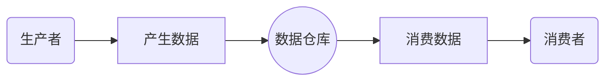

# notes for java learning
## 140 | 同步控制之synchronized
#### 修饰对象
1. 修饰一个代码块，被修饰的代码块称为同步语句块，其作用的范围是大括号{}括起来的代码，作用的对象是调用这个代码块的对象；
2. 修饰一个方法，被修饰的方法称为同步方法，其作用的范围是整个方法，作用的对象是调用这个方法的对象；
3. 修饰一个静态的方法，其作用的范围是整个静态方法，作用的对象是这个类的所有对象；
4. 修饰一个类，其作用的范围是synchronized后面括号括起来的部分，作用主的对象是这个类的所有对象。
#### 用法
1. 当两个并发线程(thread1和thread2)访问同一个对象（这个很重要）中的synchronized代码块时，在同一时刻只能有一个线程得到执行，另一个线程受阻塞，必须等待当前线程执行完这个代码块以后才能执行该代码块。
2. 当多个线程访问不同对象的同步代码块，线程访问各自同步代码块，线程不会阻塞，互不干扰。
3. 一个线程访问一个对象的synchronized代码块时，别的线程可以访问该对象的非synchronized代码块而不受阻塞。
4. 指定给某个代码块加锁：
```java
  //TODO:有明确加锁对象时
  synchronized(obj) {
    //todo
  }
  
 //TODO:无明确加锁对象时
 byte[] lock = new byte[0];
 synchronized(lock) {
    //todo
 }
 ```

 ## 141 | 同步控制之wait notify
Object类的方法
### 用法
1. `wait()/notify()/notifyAll()` 必须在相应对象的synchronized代码块中；  
2. 执行`wait()`方法后，自动失去对象的锁(monitor)，其他线程可以进入synchronized代码块
3. lost notification
notify必须在wait之后，否则可能会导致无效，使得线程无法继续下去。

## 142 | 生产者消费者模型
生产者消费者模式就是通过一个容器来解决生产者和消费者的强耦合问题。生产者和消费者彼此之间不直接通讯，而通过阻塞队列来进行通讯，所以生产者生产完数据之后不用等待消费者处理，直接扔给阻塞队列，消费者不找生产者要数据，而是直接从阻塞队列里取，阻塞队列就相当于一个缓冲区，平衡了生产者和消费者的处理能力。这个阻塞队列就是用来给生产者和消费者解耦的

### 优点：
1. 解耦–生产者。消费者之间不直接通信，降低了耦合度。
2. 支持并发
3. 支持忙闲不均
### 结构：


